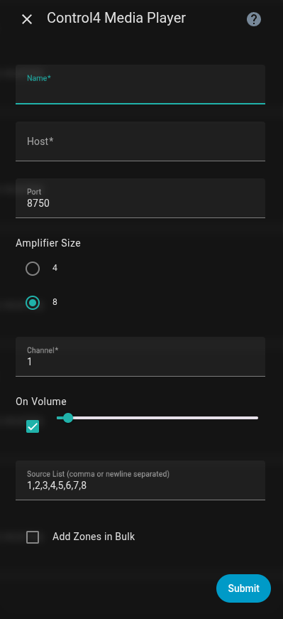
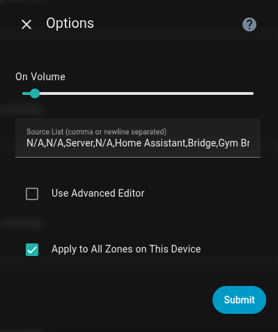
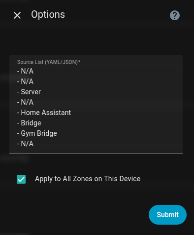
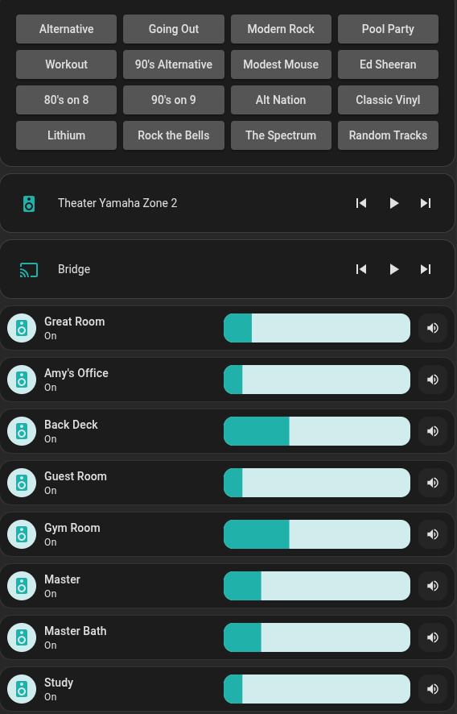

# Control4 Media Player: Home Assistant Custom Integration

[](https://hacs.xyz)
[](LICENSE)
[](https://github.com/OtisPresley/control4-mediaplayer/actions/workflows/hassfest.yaml)
[](https://github.com/OtisPresley/control4-mediaplayer/actions/workflows/hacs.yaml)
[](https://github.com/OtisPresley/control4-mediaplayer/releases)
[](https://github.com/OtisPresley/control4-mediaplayer/stargazers)
<!-- [](https://github.com/OtisPresley/control4-mediaplayer) Enable after HACS merged-->

Control4 Matrix Amplifier integration for [Home Assistant](https://www.home-assistant.io/).  
This integration alllows you to use your amplifier without a Control4 Controller and turn the channel/zones into media players in Home Assistant.

---

## Table of Contents
- [Highlights](#highlights)
- [Installation](#installation)
  - [HACS (recommended)](#hacs-recommended)
  - [Manual Install](#manual-install)
- [Migrating from configuration.yaml](#migrating-from-configurationyaml)
- [Configuration](#configuration)
  - [Adding a Single Zone](#adding-a-single-zone)
  - [Bulk Add (Add Zones in Bulk)](#bulk-add-add-zones-in-bulk)
  - [Editing Options](#editing-options-per-zone)
- [Behavior Notes & Guardrails](#behavior-notes--guardrails)
- [Troubleshooting](#troubleshooting)
- [Known Limitations](#known-limitations)
- [Development Notes](#development-notes)
- [Changelog](CHANGELOG.md)
- [Acknowledgements](#acknowledgements)
- [Support](#support)
- [License](#license)

---

## Highlights
- Add zones via **Settings → Devices & Services → Add Integration → Control4 Media Player**
- Creates a media player per zone managed via the GUI
- **Bulk Add** zones with one-pass naming and channel selection
- Tracks used channels to avoid duplicate media players
- Easily edit default volome and sources for zones after creation:
  - Simple editor (comma/newline separated list of inputs/sources)
  - **Advanced Editor** (YAML/JSON textarea) editing option + option to “Apply to all zones on this device”

<p float="left">
  
  
  
</p>

---

## Installation

### HACS (recommended)
1. In Home Assistant, open **HACS → Integrations**.
2. Click the ⋮ menu → **Custom repositories**.
3. Add this repository URL:  
   ```
   https://github.com/OtisPresley/control4-mediaplayer
   ```
   Category: **Integration**
4. Install **Control4 Media Player** from HACS.
5. Restart Home Assistant.
6. Go to **Settings → Devices & Services → Add Integration → Control4 Media Player**.

### Manual install
1. Copy the folder `custom_components/control4_mediaplayer` into your HA `config/custom_components` directory.
2. Restart Home Assistant.
3. Go to **Settings → Devices & Services → Add Integration → Control4 Media Player**.

> ⚠️ No `configuration.yaml` entries are required. Remove any legacy YAML after migrating to the UI.

---

## Migrating from `configuration.yaml`

If you already had zones defined in `configuration.yaml` using the original integration (`platform: control4-mediaplayer`),  
you can temporarily migrate them into the new format by editing the file:

```yaml
media_player:
  - platform: control4_mediaplayer
    host: 192.168.1.50
    port: 8750
    channel: 1
    name: Great Room
    ...
```

1. Change `platform: control4-mediaplayer` → `platform: control4_mediaplayer` (underscore).  
2. Restart Home Assistant. Your existing devices will be created in the UI under the integration.  

> ⚠️ This method is intended only as a **bridge**.  
> The recommended approach is to delete the YAML and re-add zones through the **UI via the integration**, which generates **unique IDs** and registers your devices/entities properly in HA.  

Once you confirm your devices exist in the UI, you can safely remove the YAML block from `configuration.yaml`.

---

## Configuration

### Adding a Single Zone
1. **Name**: Friendly name for the zone (e.g., “Great Room”).
2. **Host / Port**: IP of your Control4 amp and UDP port (default `8750`).
3. **Amplifier Size**: `4` or `8`.  
   This bounds **Channel** numbers and limits **Source List** size.
4. **Channel**: Required, bounded by amplifier size.  
   - If a channel is already in use, the form re-shows with the **next available** channel selected.
5. **On Volume**: 0–100 (default integration value).
6. **Source List**: Comma/newline separated.  
   Defaults to `1..N` based on amp size, or inherits from another zone on the same amp.

---

### Bulk Add (Add Zones in Bulk)
1. Toggle **Add Zones in Bulk** and press **Submit** once → the form re-renders showing:
   - **Zone Prefix (bulk)**
   - **Zone Count (bulk)** (bounded by remaining free channels)
2. If all zones are already configured for that `host:port`, the flow shows:  
   **“All zones are already configured for host:port.”**
3. After submit, a second screen allows **unique names per channel**, prefilled using the prefix.

---

### Editing Options (per zone)
- **Simple Editor**
  - **On Volume**: 0–100
  - **Source List**: comma/newline separated (auto-normalized)
  - **Apply to All Zones on This Device**: propagate the Source List to other zones with the same `host:port`.
- **Advanced Editor (YAML/JSON)**
  - Multiline textarea
  - Accepts YAML **or** JSON
  - Example:
    ```yaml
    - HC800-1
    - HC800-2
    - Server
    - Home Assistant
    ```
  - Parse errors keep you on the page with a friendly error + inline example.

---

## Behavior Notes & Guardrails
- **Form re-render** occurs only when:
  - **Amplifier Size** changes, or
  - **Add Zones in Bulk** is toggled  
- **Channel** values are automatically clamped to `1..AmpSize`.
- **Zone Count** is clamped to the number of available channels.
- **Source List** longer than Amp Size is truncated.
- When editing/adding on the same `host:port`, the **Source List** auto-inherits unless overridden.

Example Dashboard Cards:



---

## Troubleshooting
- **“All zones are already configured for host:port.”**  
  → You’ve used all channels for the selected Amp Size.
- **“Channel X is already configured on host:port. Next available is Y.”**  
  → Select Y or another free channel.
- **“Channel must be between 1 and N.”**  
  → Adjust the channel or set the correct Amp Size.
- **Fields don’t appear until after I toggle “Add Zones in Bulk”.**  
  → Expected: forms re-render after you press **Submit** once.
- Integration not appearing in “Add Integration” screen?  
  → Verify `custom_components/control4_mediaplayer` is correctly placed and `manifest.json` has `domain: control4_mediaplayer`.
- After updating this integration’s code, bump `"version"` in `manifest.json` and restart HA.
- If UI looks stale, hard-refresh your browser (**Shift+F5**).

---

## Known Limitations
- No automatic network discovery (Control4 protocol without a controller is limited).
- The form can’t live-update fields without submit; a minimal “soft refresh” pattern is used.

---

## Acknowledgements
This integration is a fork of the original [control4-mediaplayer](https://github.com/Hansen8601/control4-mediaplayer) by [@Hansen8601](https://github.com/Hansen8601).  
Huge thanks to their initial work building the foundation that made this project possible.  
This fork expands with config flow (UI), bulk add, advanced source editing, and other enhancements.

---

## Support
- [Open an issue](https://github.com/OtisPresley/control4-mediaplayer/issues) if you find a bug.
- Contributions via PRs are welcome.

If you find this integration useful and want to support development, you can:

[](https://www.buymeacoffee.com/OtisPresley)
[](https://paypal.me/OtisPresley)

---

## License
This project is licensed under the terms of the [MIT license](LICENSE).
